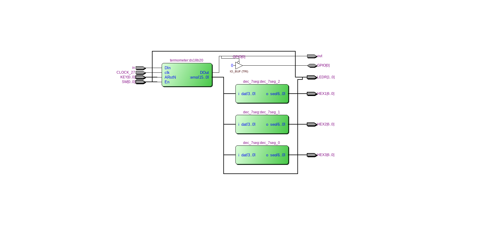

=============================================
ДКР
=============================================

Тема
------

Периферійний модуль OneWire

Хід роботи
-------

**Завдання** 
	Завданням було розробити периферійний модуль інтерфейсу OneWire.

**Створення проекту** 
	Проект було вирішено створювати на мові Verilog, тому що це зайняло набагато менше часу, ніж створення схеми
у схемному редакторі. Для спрощення роботи над пристроєм мною було вирішено кожен блок створити в окремому файлі, що дуже сильно спростило збирання та
відладку пристрою. Потім мною було написано тестовий файл на мові Verilog, що допомогло відладити пристрій.

**Опис виконаної роботи** 
	Було спочатку реалізовано модуль який безпосередньо працює зі слейвом(приймає та відправляє дані). Далі було зроблено "надбудову", в яку записуються та
зчитуються дані. Перевагою цієї "надбудови" є  те, що вона спрощує роботу з цим модулем. Також за допомогою неї зі слейва можна зчитувати або записувати до нього
більше ніж 1 байт даних з раз. Можна було розширити внутрішній регістр даних, але цей модуль може зчитувати/записувати за раз кіль-ть бітів, яка рівна розрядності
внутрішніх регістрів і процес зчитування/запису зупинити посередині не можна. Також модуль підтримує стандартні для всіх OneWire пристроїв ROM команди: SKIP ROM,
MATCH ROM, READ ROM. Для демонстрації роботи було вирішено зробити термометр на датчику температури DS18B20 з виводом виміряної температури на семисегментні
індикатори.

Так виглядає RTL схема GPIO модуля
